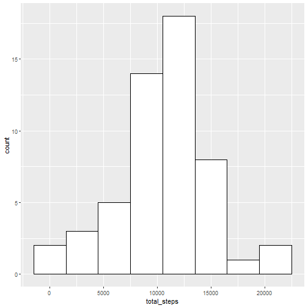

This report consist the tasks and code to solve the Peer Assignment 1 to Week 2 of a Reproducible Research course. 


## 1. Loading and preprocessing the data

As the dataset is already exist in your working directory (you should set it to the folder with your forked repository from the Git), here I proceed directly to unzip the dataset "activity.zip":


```r
unzip("activity.zip")
dataActivity <- read.csv("activity.csv")
```

After loading the data, here also the first 6 rows of the dataset to become familiar how the data looks like:


```r
head(dataActivity)
```

```
##   steps       date interval
## 1    NA 2012-10-01        0
## 2    NA 2012-10-01        5
## 3    NA 2012-10-01       10
## 4    NA 2012-10-01       15
## 5    NA 2012-10-01       20
## 6    NA 2012-10-01       25
```

## 2. What is mean total number of steps taken per day?

This part of the task consist few steps to do.

1. Calculate the total number of steps taken per day.

For this task I used package **dplyr** and functions *group_by* to group the data by date and *summarise* to apply *sum()* to calculate the sum of steps for each day. The code: 

```r
library("dplyr")
```

```r
dataActivity1 <- dataActivity %>%
                 group_by(date) %>%
                 summarise(total_steps = sum(steps))
```

Here is how the dataset looks now:


```r
head(dataActivity1)
```

```
## # A tibble: 6 x 2
##   date       total_steps
##   <chr>            <int>
## 1 2012-10-01          NA
## 2 2012-10-02         126
## 3 2012-10-03       11352
## 4 2012-10-04       12116
## 5 2012-10-05       13294
## 6 2012-10-06       15420
```

2. Make a histogram of the total number of steps taken each day.

For the histogram, the **"gglot2"** package was used. The histogram shows how often the result in some ranges appeared. For this histogram, the ranges were defined as each 3000 steps.


```r
library("ggplot2")
ggplot(data = dataActivity1, aes(x = total_steps)) + geom_histogram(color="black"
               , fill="white"
               , binwidth = 3000)
```



3. Calculate and report the mean and median of the total number of steps taken per day.

The **NA** values were not considered for this calculations.


```r
mean(dataActivity1$total_steps, na.rm = TRUE)
```

```
## [1] 10766.19
```

```r
median(dataActivity1$total_steps, na.rm = TRUE)
```

```
## [1] 10765
```

## 3. What is the average daily activity pattern?

1. Make a time series plot (i.e. type = "l") of the 5-minute interval (x-axis) and the average number of steps taken, averaged across all days (y-axis). As we already called out **dplyr** and **ggplot2** packages before, here we do not call them again:


```r
dataActivity2 <- dataActivity %>%
  group_by(interval) %>%
  summarise(sumSteps = sum(steps, na.rm = TRUE)
          , meanSteps = mean(steps, na.rm = TRUE))
plot(x = dataActivity2$interval, y = dataActivity2$meanSteps, type = "l")
```


2. Which 5-minute interval, on average across all the days in the dataset, contains the maximum number of steps?

To find the maximum value of average number of steps per interval, the function *which.max* was used:


```r
dataActivity2$interval[which.max(dataActivity2$meanSteps)]
```

```
## [1] 835
```

## 4. Imputing missing values

1. Calculate and report the total number of missing values in the dataset (i.e. the total number of rows with NAs).


```r
sum(is.na(dataActivity$steps))
```

```
## [1] 2304
```

2. Devise a strategy for filling in all of the missing values in the dataset. The strategy does not need to be sophisticated. For example, you could use the mean/median for that day, or the mean for that 5-minute interval, etc.

For this task, the strategy of filling the missing value was to use the mean value of steps for each 5-minute interval. 

3. Create a new dataset that is equal to the original dataset but with the missing data filled in.

The mean value of each 5-minute interval was added as a column in new dataset *dataActivity3*:


```r
dataActivity3 <- dataActivity %>%
  group_by(interval) %>%
  mutate(meanSteps = mean(steps, na.rm = TRUE)) %>%
  mutate(steps = ifelse(is.na(steps), meanSteps, steps)) %>%
  ungroup()
```

4. Make a histogram of the total number of steps taken each day and Calculate and report the mean and median total number of steps taken per day. 


```r
dataActivity3 <- dataActivity3 %>%
  group_by(date) %>%
  summarise(total_steps = sum(steps))

ggplot(data = dataActivity3, aes(x = total_steps)) + geom_histogram(color="black"
               , fill="white"
               , binwidth = 3000)
```


```r
mean(dataActivity3$total_steps, na.rm = TRUE)
```

```
## [1] 10766.19
```

```r
median(dataActivity3$total_steps, na.rm = TRUE)
```

```
## [1] 10766.19
```

As we see, the mean and median values match in this case (in previous case they differ).

Do these values differ from the estimates from the first part of the assignment? What is the impact of imputing missing data on the estimates of the total daily number of steps?


```r
ggplot() + 
  geom_histogram(data = dataActivity1, aes(total_steps)
                                                                , fill="blue"
                                                                , alpha = 0.3
                                                                , binwidth = 3000) +
  geom_histogram(data = dataActivity3, aes(total_steps)
                   , fill="red"
                   , alpha = 0.3
                 , binwidth = 3000)
```

```
## Warning: Removed 8 rows containing non-finite values (stat_bin).
```


As we can see from the histogram, the filling of missing values with the mean values for each 5-min interval resulted in a higher total steps count.

## 5. Are there differences in activity patterns between weekdays and weekends?

1. Create a new factor variable in the dataset with two levels – “weekday” and “weekend” indicating whether a given date is a weekday or weekend day.

At first, changing the system language to English:

```r
Sys.setlocale("LC_TIME", "English")
```

```
## [1] "English_United States.1252"
```

The part of leveling the data into factors "weekday" and "weekend" is presented in a next chunk with the second part of task below.

2. Make a panel plot containing a time series plot (i.e.type = "l") of the 5-minute interval (x-axis) and the average number of steps taken, averaged across all weekday days or weekend days (y-axis). See the README file in the GitHub repository to see an example of what this plot should look like using simulated data.


```r
dataActivity4 <- dataActivity %>%
  group_by(interval) %>%
  mutate(meanSteps = mean(steps, na.rm = TRUE)) %>%
  mutate(steps = ifelse(is.na(steps), meanSteps, steps)) %>%
  ungroup() %>%
  mutate(day = weekdays(as.Date(date), abbreviate = FALSE)) %>%
  mutate(weekday = ifelse(day %in% c("Saturday", "Sunday"), "weekend", "weekday")) %>%
  group_by(interval, weekday) %>%
  mutate(meanWeek = mean(steps))

ggplot(dataActivity4) + 
  geom_line(aes(interval, meanWeek, color = weekday), alpha = 0.7, lwd = 2) +
  facet_wrap(~weekday, ncol = 1)
```


Thank you for reviewing! 


